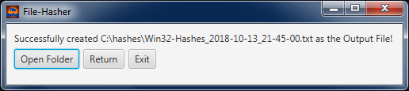

# File-Hasher
A Program for mass-checking the SHA-512 Hash of whole Subdirectories.

## How to use
Go to the [Releases-Tab](../../releases) and download the attached JAR-File. Put the file into a folder wherever you want but **don't let them in the Downloads Folder** since all Output Files will be created in that folder.

## Pictures
Here some pictures that you know how the GUI looks like:

### Program
 
 

### Icon

## FAQ
- Q: How to use it? 
  A: Read the text above. ;)